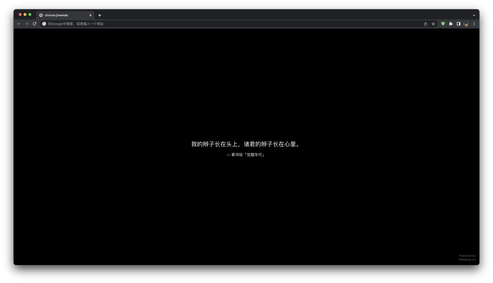

  

<h1 align="center">Hitokoto</h1>

> A beautiful tab with one sentence.

## ✨ Features

- **chrome://newtab**: Beautiful new tab page with Hitokoto.
- **Dark Mode Support**: Auto toggle `prefers-color-scheme: dark`.

## 📦 Install

1. Download dist dir.
2. Toggle developer mode in extension and then import dist.

## License

[GNU GPLv3](./license) License © 2022 [Eureka](https://github.com/echoeureka)